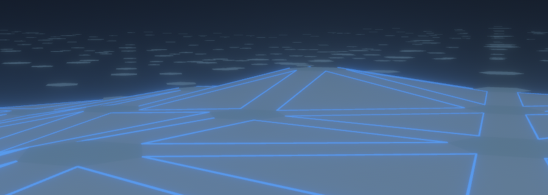
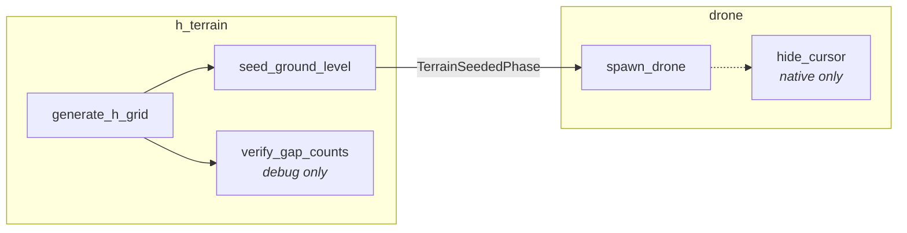

# 3d geometric play with rust,bevy & mrOpus

 
          v2----v1
         /       \
       v3          v0
         \        /
          v4----v5

## 1st proto memory:

## Startup system ordering

