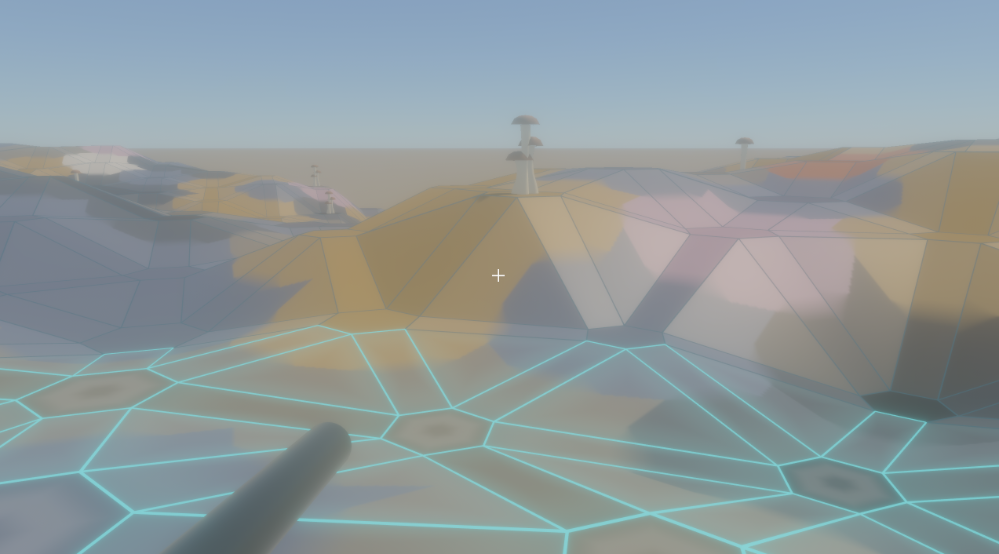
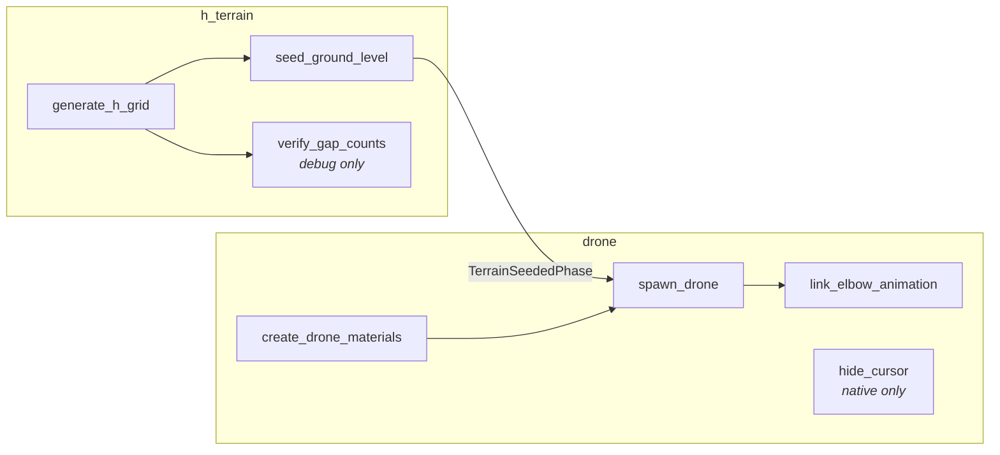
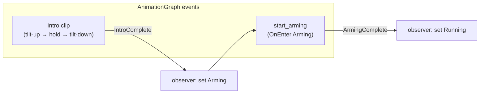
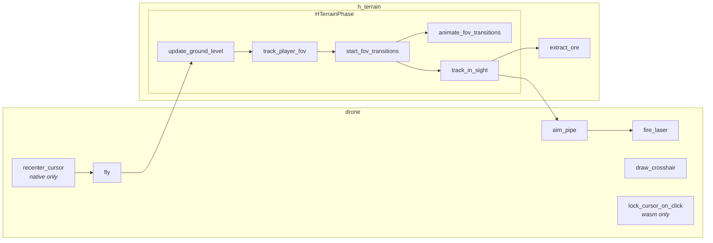

[](https://codecov.io/gh/dynnamitt/hex-terrain)

# 3d geometric play with rust,bevy & mrOpus

[](https://dynnamitt.github.io/hex-terrain/)


## Usage

```bash
cargo run                              # default: intro → arming → free-fly
cargo run -- --biome mesa-lush         # biome preset (standard/rocky/mesa/mesa-lush)
cargo run -- --debug                   # FPS overlay + gap count verification
cargo run -- --intro-duration 3        # shorter intro tilt-up
make wasm && make serve                # WASM build on localhost:8080
```

### Controls

| Input       | Action                 |
| ----------- | ---------------------- |
| WASD        | Move                   |
| Mouse       | Look                   |
| Q / E       | Lower / raise altitude |
| Scroll      | Adjust altitude        |
| Space / LMB | Fire laser (mine ore)  |
| Escape      | Quit                   |

### Feature flags

```bash
cargo run --features remote            # BRP HTTP server for MCP debugger
cargo run --features inspector         # egui world inspector
```

## Startup system ordering


```mermaid
graph LR
    generate_h_grid --> seed_ground_level
    generate_h_grid --> verify_gap_counts
    seed_ground_level -- TerrainSeededPhase --> spawn_drone
    create_drone_materials --> spawn_drone
    spawn_drone --> link_elbow_animation

    subgraph h_terrain
        generate_h_grid
        seed_ground_level
        verify_gap_counts[verify_gap_counts<br/><i>debug only</i>]
    end

    subgraph drone
        create_drone_materials
        spawn_drone
        link_elbow_animation
        hide_cursor[hide_cursor<br/><i>native only</i>]
    end
```

## State transitions — Intro & Arming


```mermaid
graph LR
    intro_clip["Intro clip<br/>(tilt-up → hold → tilt-down)"]
    intro_clip -- IntroComplete --> set_arming["observer: set Arming"]
    set_arming --> start_arming["start_arming<br/>(OnEnter Arming)"]
    start_arming -- ArmingComplete --> set_running["observer: set Running"]

    subgraph "AnimationGraph events"
        intro_clip
        start_arming
    end
```

## Update systems — Running


```mermaid
graph LR
    recenter_cursor --> fly
    fly --> update_ground_level
    update_ground_level --> track_player_fov
    track_player_fov --> start_fov_transitions
    start_fov_transitions --> animate_fov_transitions
    start_fov_transitions --> track_in_sight
    track_in_sight --> aim_pipe
    track_in_sight --> extract_ore
    aim_pipe --> fire_laser

    subgraph drone
        recenter_cursor[recenter_cursor<br/><i>native only</i>]
        fly
        draw_crosshair
        aim_pipe
        fire_laser
        lock_cursor_on_click[lock_cursor_on_click<br/><i>wasm only</i>]
    end

    subgraph h_terrain
        subgraph HTerrainPhase
            update_ground_level
            track_player_fov
            start_fov_transitions
            animate_fov_transitions
            track_in_sight
        end
        extract_ore
    end
```


