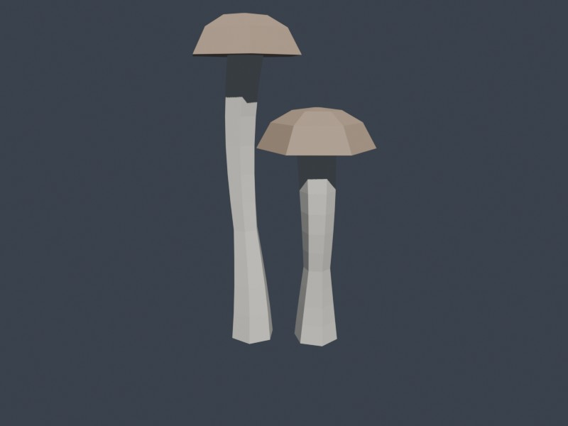

# flora

Procedural hexagonal mushroom meshes for hex-terrain.



## Overview

Generates low-poly shimeji mushrooms with 6-sided (hexagonal) cross-sections,
matching the hex theme of the terrain. Stems have sinusoidal bend, variable
diameter, and twist. Caps are domed with an underside annulus.

## Geometry

- **Stem**: 11 hex rings, 10 quad segments, bottom cap fan (67 verts)
- **Cap**: 4 hex rings converging to apex + underside (31 verts)
- **Total**: 98 verts per mushroom

One stem mesh and one cap mesh are shared across all instances.
Clones use `Transform` variation only (scale, rotation, offset).

## Usage

```rust
use flora::{FloraCfg, FloraMaterials, cluster::shimeji_cluster};

// At startup: create shared assets once
let cfg = FloraCfg::default();
let assets = FloraMaterials::new(&mut materials, &mut meshes, &cfg);

// Spawn clusters (1-3 mushrooms each)
let entities = shimeji_cluster(&mut commands, &assets, &cfg, pos, 2);
```

### Cluster sizes

| `num` | Mushrooms | Entities | Description |
|-------|-----------|----------|-------------|
| 1 | 1 | 3 | Single tall mushroom |
| 2 | 2 | 5 | Tall + shorter rotated clone |
| 3 | 3 | 7 | Tall + 2 cascading clones |

## Reference asset

`assets/shimeji.glb` in the project root contains the Blender-exported
reference model (not loaded at runtime).
